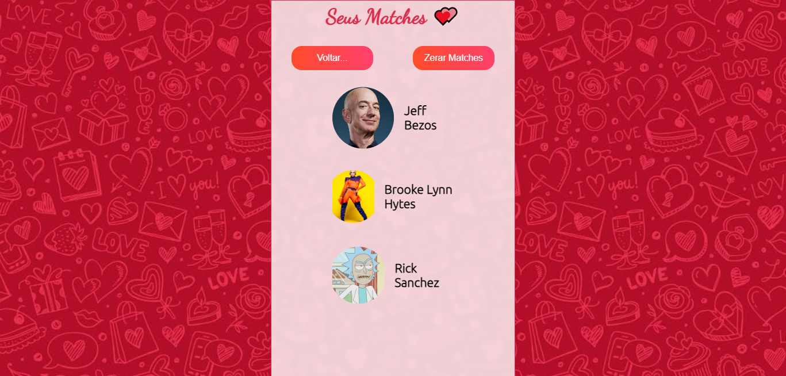

# Projeto Astromatch

Aplicação inspirada na proposta do Tinder  :heart_on_fire:

Ferramentas e tecnologias usadas:

- React;
- Styled Components;
- Postman;
- Api [Astro Match](https://documenter.getpostman.com/view/7549981/SW12yx56?version=latest);
- Requisições, renderização condicional, hooks, eventos, key frames.

**---> [Link Surge](https://powerful-vacation.surge.sh/) <---**

# Prints do deploy

### Página inicial 

### Área de Matches

## Página Inicial

Onde é possível escolher se da match (escolha positiva) ou descarta o perfil selecionado.
Após esgotarem os perfis vistos, é informado por um alert e a lista de perfis é resetada.

## Área de Matches

Exibe os perfis que tiveram a escolha cruzada,  feito de forma aleatória pela API.
Botão zerar matches reseta a lista de perfis vistos.