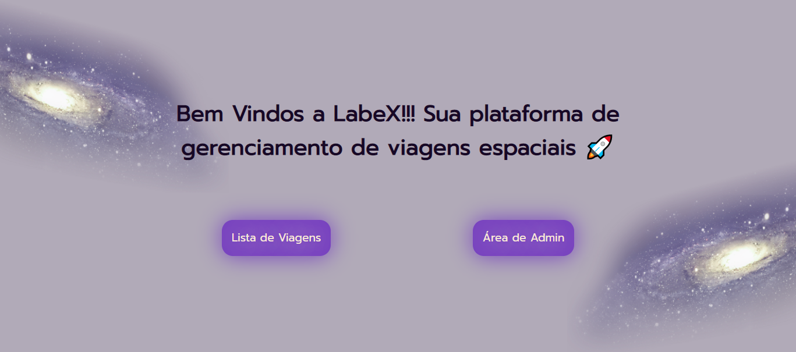
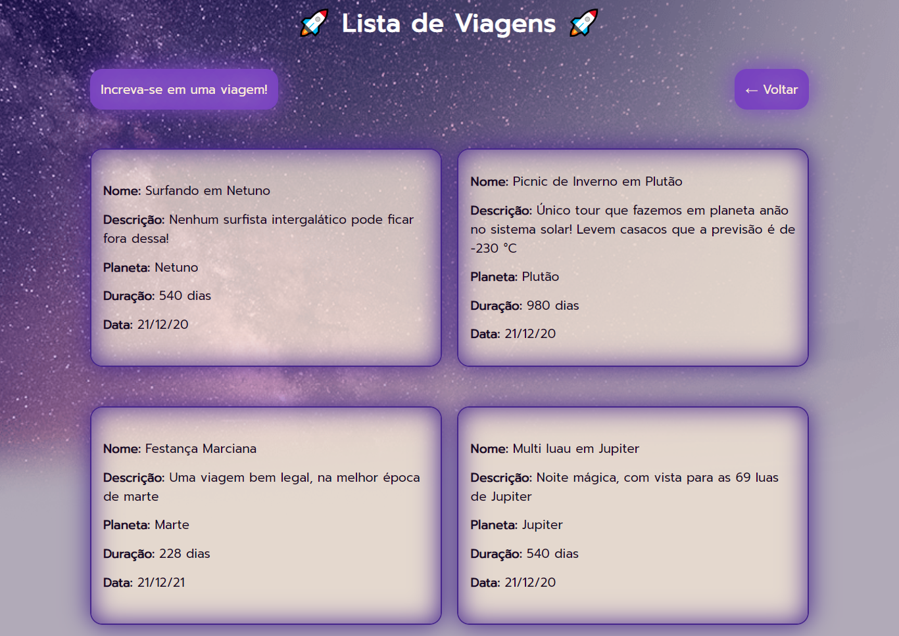
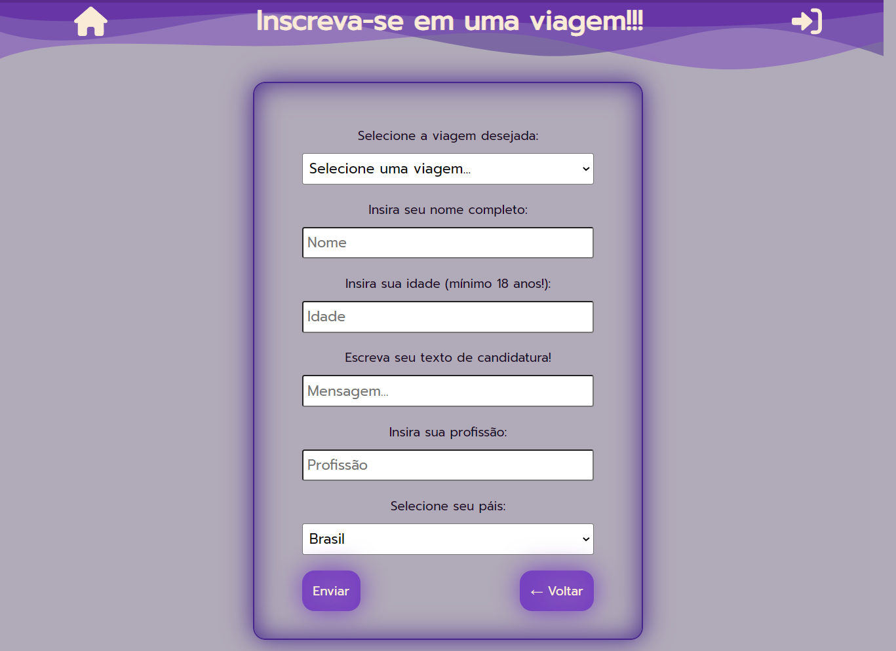
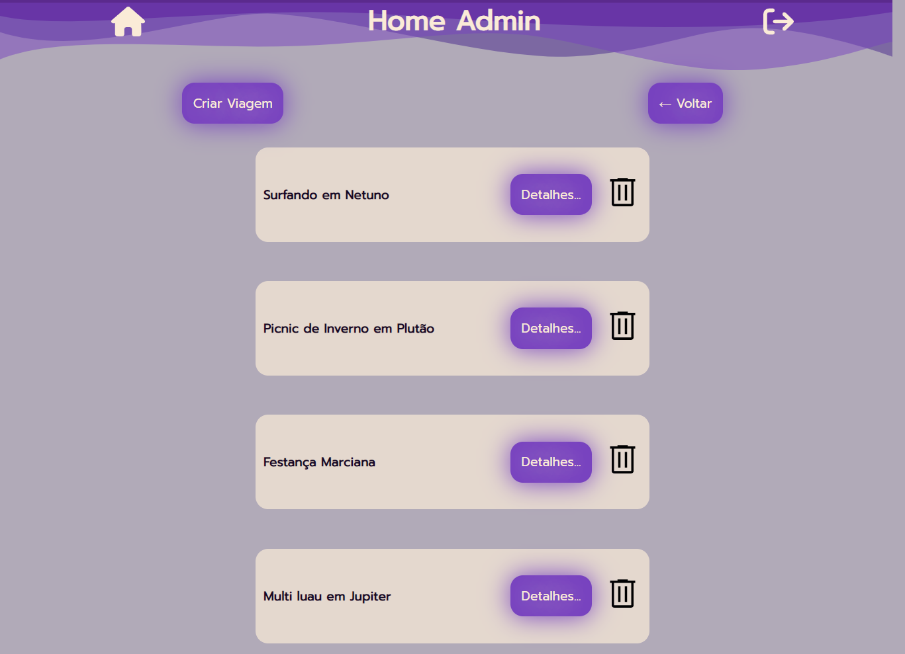
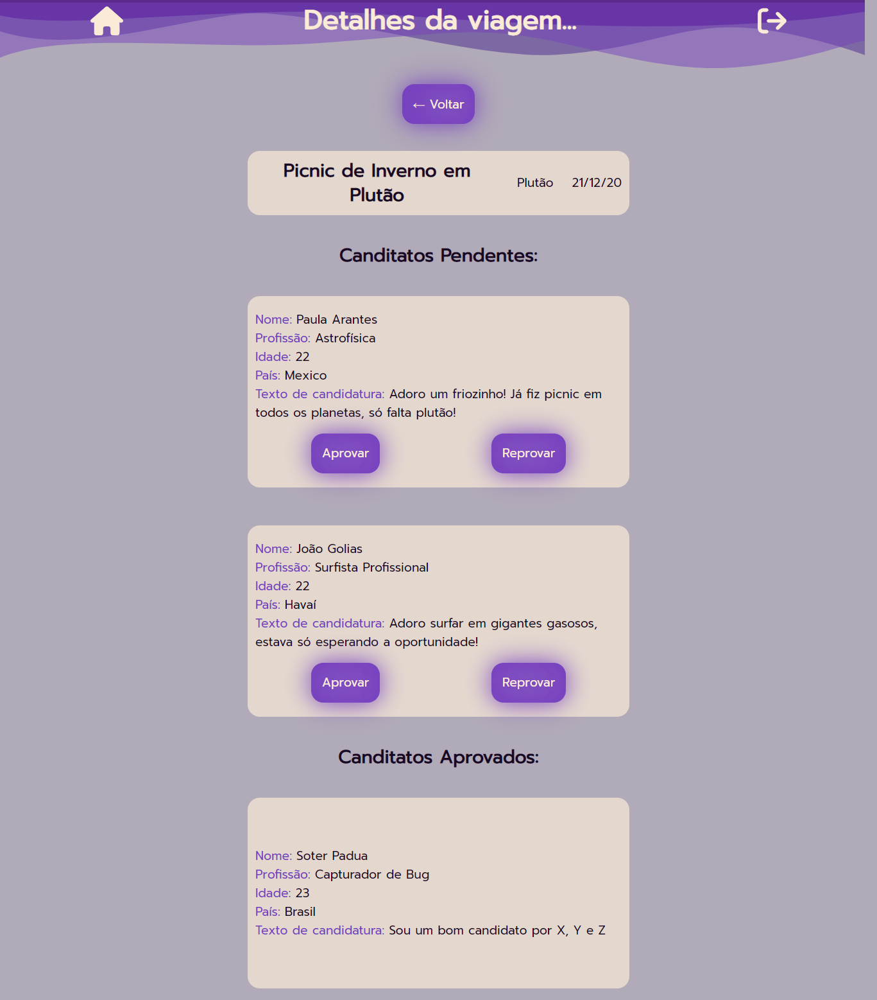
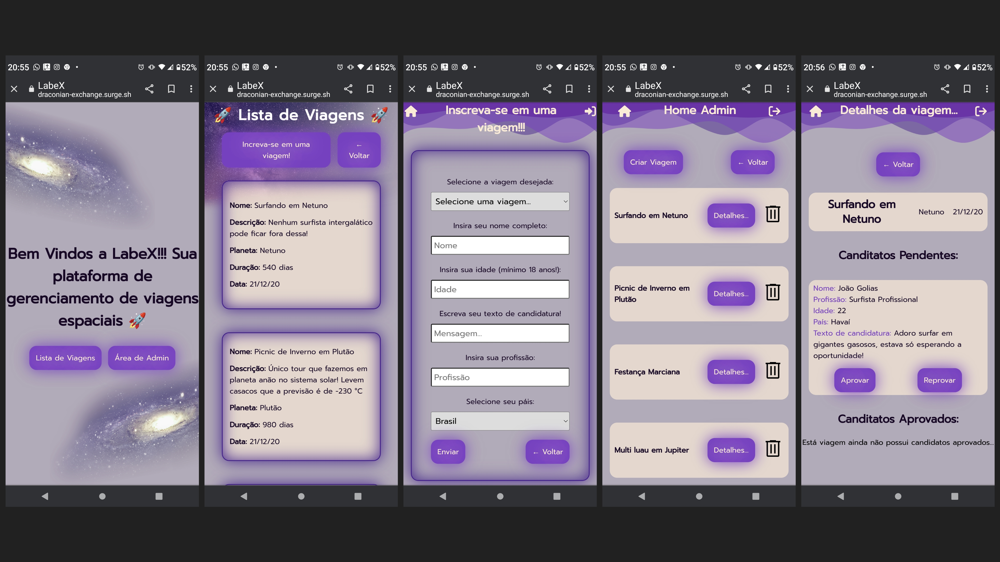

# Projeto LabeX 🚀

Projeto Desenvolvido em **React** e **Styled Components** com consumo da Api [LabeX](https://documenter.getpostman.com/view/9133542/TzCTZkQr).

### Plataforma de viagens onde é possível:

- Visualisar viagens do banco de dados;
- Candidatar-se à uma viagem através de formulário;
- Logar com administrador;
- Criar novas viagens;
- Aprovar ou reprovar candidatos da viagem;

### Conceitos aplicados:

- Requisições;
- Autenticação com sessionStorage;
- Navegação com React Router;
- Renderização condicional;
- React Forms;
- Hooks: useState, useEffect;
- Custom Hooks;
- Responsividade;

---> [Link do Deploy](https://draconian-exchange.surge.sh/) <---

Login de admin: 
- E-mail: bianca.paccola@gmail.com
- Senha: 123456

## Prints das telas

