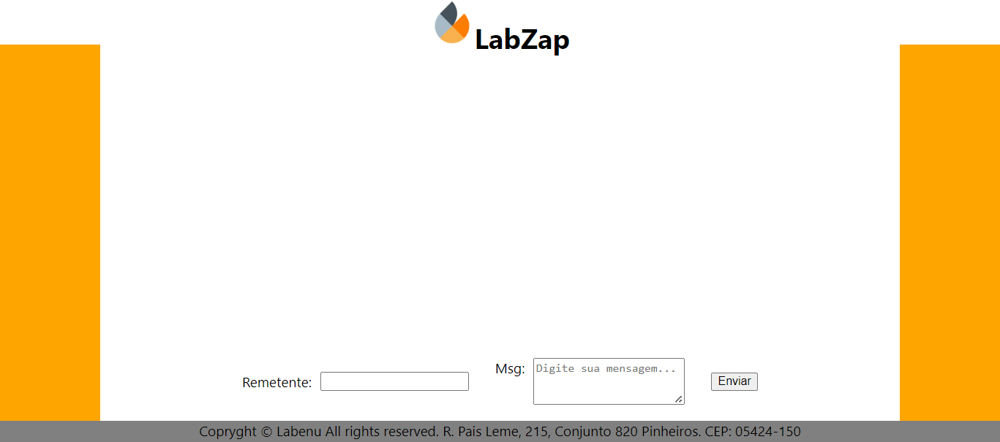

# Projeto LabZap

Primeiro projeto desenvolvido para treinar os conhecimentos adquiridos durante as aulas de introdução ao **React**; é um protótipo de chat.

Bibliotecas usadas: **React** e **Styled Components**

[Link Surge](https://kaput-partner.surge.sh/)

## Print do Projeto

