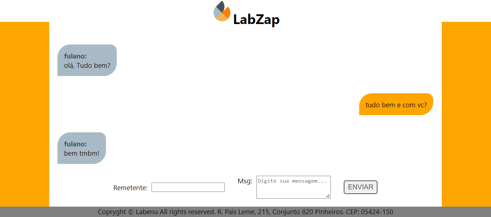
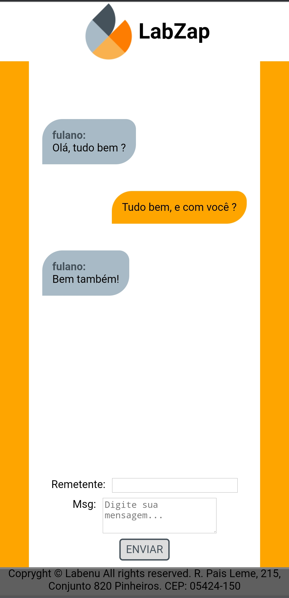

# Projeto LabZap

Primeiro projeto desenvolvido para treinar os conhecimentos adquiridos durante as aulas de introdução ao **React**; é um protótipo de chat.

Bibliotecas usadas: **React** e **Styled Components**

## Funcionalidades
- Submete os inputs com enter e clicando no botão;
- Remetente 'eu' se diferencia dos demais; (tratamento de string com LowerCase e Trim);
- Deleta a mensagem ao clicar 2 vezes sobre ela (window confirm);
- Barra de rolagem quando as mensagens ultrapassam o limite de altura da tela;
- Textarea limitado a 150 caracteres;
- Layout responsivo para mobile.

[Link Surge](https://kaput-partner.surge.sh/)

## Print's do Projeto

